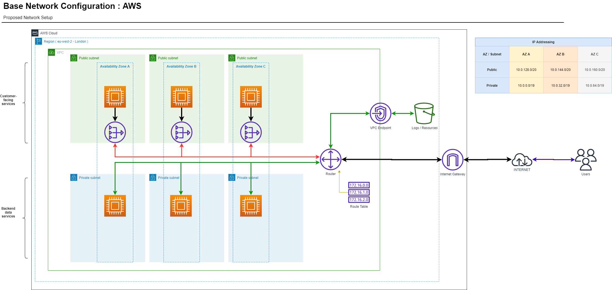

# Account Network Setup

## AWS Base Network Setup

The terraform here creates core networking setup of VPC, Subnets ( Public and Private ) , Routing, Routing tables, NAT Gateway and an Internet Gateway.

It is designed as the base-layer for all other services to bolt onto and represents the low-level networking layer for data transit.

## Configuration

### Network Setup

*v 1.0*
The code will generate a single VPC, with three subnets defined and split across the az's defined.

A single Internet gateway is defined for the account, each public subnet has it's own NAT Gateway defined to provide throughput for sevices.




## Terraform

If running locally, terraform state files will be created which are used to maintain the current running state of the infrastructure.
This will be used for calculating any changes that need to take place - ideally we would maintain these state files in an S3 bucket with versioning siwtched on. This has been achieved through using the S3 state bucket created in the [Terraform Bucket](terraform-bucket/README.md) configuration.

*In this way, The state file will be stored in the S3 bucket of whatever account is having the network created within.*


### Test changes

A Terraform **plan** will calculate the changes that need to take place to bring the infrastructure in line with the code. For the first time this will show a large amount of additions to the system. For subsequent operations it will show less changes.

From within the *account-network* folder, run the terraform to build using the correct variables ( for whichever environment you need ) in the following format:

```terraform plan -var-file="./dev/variables.tfvars" -var "aws_access_key=xxxx" -var "aws_secret_key=xxxxxx" -var "region=eu-west-2"```

Replace the values for access and secret keys as necessary. 

### Build system

To build or apply changes you need to utilise the **apply** command in the same syntax as a plan:

```terraform apply -var-file="./dev/variables.tfvars" -var "aws_access_key=xxxx" -var "aws_secret_key=xxxxxx" -var "region=eu-west-2"```

### Destroy network setup

The **destroy** command will calculate all resources that need to be removed based on the code that exists. This will confirm if you really want to remove all of the configuration from aws.

```terraform destroy -var-file="./dev/variables.tfvars" -var "aws_access_key=xxxx" -var "aws_secret_key=xxxxxx" -var "region=eu-west-2"```