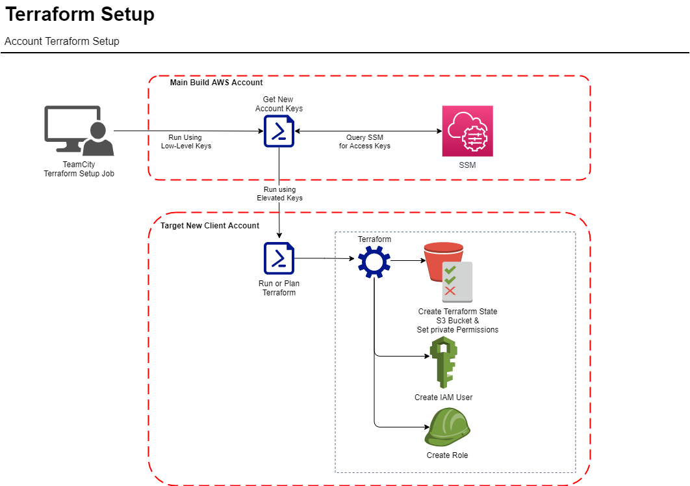

# S3 Terraform Bucket, DevOps User and IAM Permissions

The terraform process is designed with **least-privilege processes**. The initial call is to the "AWS Build Account" with a limited set of access. This in turn results in the least-privilege keys to the associated secondary account. From there the keys are rotated in, a connection is made to the new account and operations run.

For any service that lives atop the main setup, their own IAM policy should be present to operate and should not rely on the DevOps user in the accounts for access rights to the various components required in AWS.




## Step 1: Setting up the IAM permissions for the primary devops user

1. Create a new programmatic access user in the new account. This user will be utilised for the primary terraform operation for that account. 
2. Attach the following AWS managed policies:

* AmazonEC2FullAccess
* AmazonEC2RoleforSSM
* AmazonEC2RoleforAWSCodeDeploy
* AWSCodeDeployFullAccess
* AmazonEC2RoleforDataPipelineRole
* AWSCodePipeline_FullAccess
* AmazonEC2RoleforAWSCodeDeployLimited

3. Copy the new keys ready to use in the next step.

## Step 2: Store the new keys
Store the new keys in the AWS Account - Systems Manager ( SSM ) Parameter Store using the following format:

```
/gingerco/deploy/dev/{client_name}/deployment_access/access.key
/gingerco/deploy/dev/{client_name}/deployment_access/secret.key
```

These can then be used for the following step to generate the bucket:

## Step 3: Setting up the base S3 bucket for terraform state storage on the account

This script is designed to generate the S3 bucket in your new account:

### Running code

To run the code from your machine: 

```setup {deployment environment:dev/stage/live} {client name for service prefix} {how to run code: deploy/plan}```

For example:

```setup dev gingerco plan```


## Step 3: Create and attach the following policy to your new DevOps User:

```
{
    "Version": "2012-10-17",
    "Statement": [
        {
            "Effect": "Allow",
            "Action": [
                "s3:PutObject",
                "s3:GetObject",
                "s3:ListBucket",
                "s3:DeleteObject",
                "s3:GetObjectVersion"
            ],
            "Resource": [
                "arn:aws:s3:::{client_name}-terraform",
                "arn:aws:s3:::{client_name}-terraform/*"
            ]
        }
    ]
}
```

Name it *s3-terraform* so that you can easily see what it is.

This will allow the user to access and use the folder correctly going forward.

Note: The terraform script to create the bucket does not store the state in S3 ( for obvious reasons ). It is designed as a fire and forget item you can run from your own machine using the new credentials you create for initial account setup.